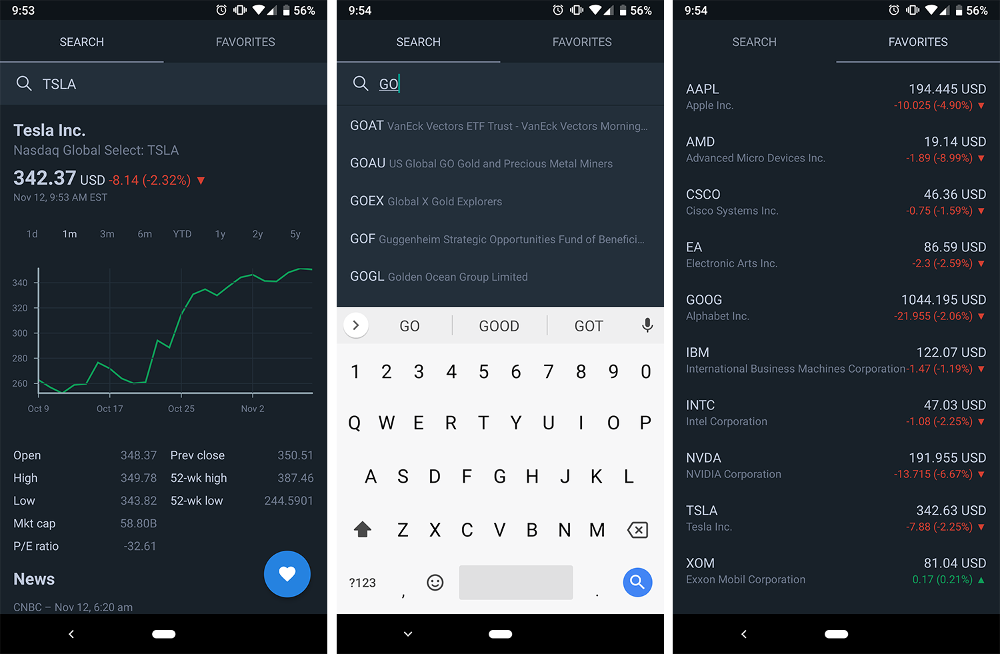

# Market Tracker App

* This app uses an API to get recent prices of stocks. 
* Users can search for a certain stock, view the recent price data and add that stock to their favorites. 
* By adding to favorite, users will be able to see the stock appear in the second tab. There they can quickly view the data instead of having to look up the stock again. 

## :camera: Demo





## :computer: How to deploy.

``` bash
# First clone the repo.

# install dependencies
yarn install

# start development server
yarn start

# build
expo build:android
# or
expo build:ios
```

## :file_folder: License

* This project is licensed under the terms of the MIT license.

## :envelope: Contact

* Repo created by [Stanley Moukhametzianov](https://github.com/Stanley-Moukhametzianov?tab=repositories).
